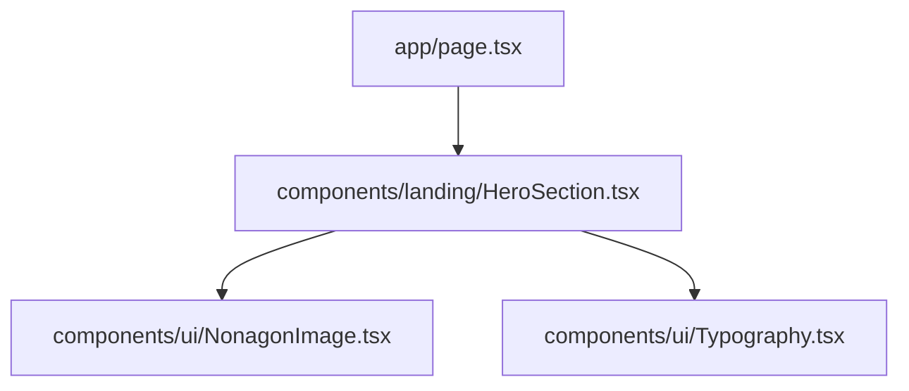

# 🎯 SOYORO MASTER PLAN

## 1. 개요 (Overview)

- **페이지:** 랜딩 페이지 (단일 페이지, Mobile First)
- **목표:** 'SOYORO' 예술경영 입시과외의 차별점과 철학을 전달하는 첫 번째 섹션 구축.
- **주요 UI 요소:**
  - `Pretendard` 폰트 적용 (가변 서브셋)
  - 9각형(Nonagon) 형태의 이미지 마스크 (CSS `clip-path` 활용)
  - 헤딩 타이포그래피 ("2026년은 예술경영 합격...")
  - 본문 텍스트 (입시생 시절의 경험, 소요로의 철학)

## 2. 컴포넌트 구조 (Component Architecture)

## 3. 작업 페이즈 (Phases)

- [ ] **Phase 1: 폰트 및 글로벌 스타일 설정**
  - `layout.tsx`에 Pretendard 가변 폰트 적용
  - Tailwind 기본 설정(컬러, 폰트 패밀리)
- [ ] **Phase 2: UI 컴포넌트 개발**
  - `NonagonImage`: 9각형 클립 패스가 적용된 이미지 컴포넌트 (`clip-path: polygon(...)`)
  - Typography 컴포넌트 클래스 유틸 정의 (모바일 우선 반응형 사이즈)
- [x] **Phase 3: Hero 섹션 조립**
  - 가이드라인 라인(Border), 간격(Margin/Padding)을 픽셀 퍼펙트에 가깝게 구현.
  - 모바일(390px 근방) 기준의 레이아웃 최적화.
- [ ] **Phase 4: Review 섹션 개발**
  - `ReviewCard`: 학생들의 합격 후기를 담는 카드 컴포넌트 (태그, 학교, 후기 텍스트 등)
  - `ReviewSection`: 리뷰 카드들을 세로로 나열하는 컨테이너 섹션.
